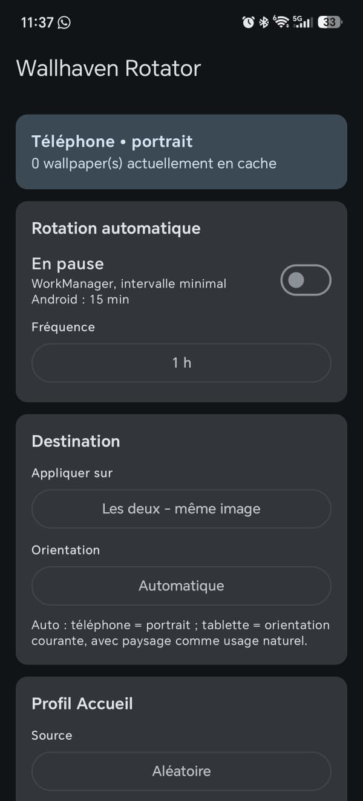
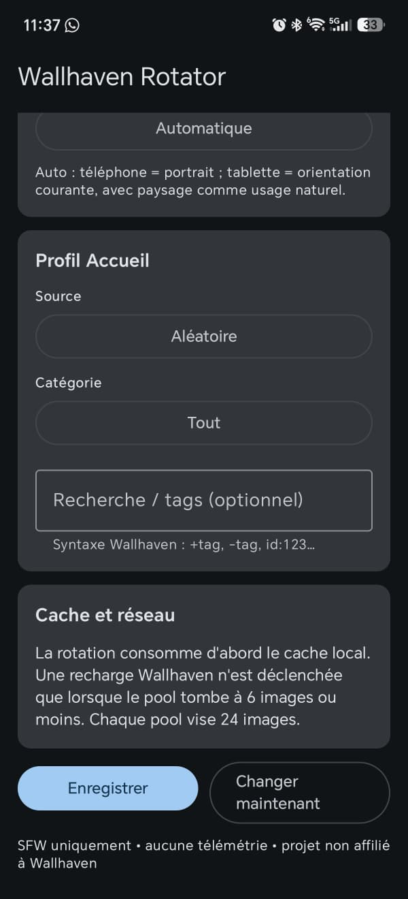

# Wallhaven Rotator Android

Android companion to **Wallhaven Rotator**, built around the public SFW Wallhaven API.

> This project is not affiliated with or endorsed by Wallhaven.

## Screenshots

<p align="center">
  
  &nbsp;&nbsp;
  
</p>

## Features

- Android 7.0+ (`minSdk 24`)
- Home screen, lock screen, same image on both, or independent home/lock profiles
- Automatic orientation policy:
  - phone: portrait by default
  - tablet: uses the current tablet orientation in Auto mode, with landscape as the natural default use case
  - explicit Portrait / Landscape overrides
- Wallhaven sources matching the desktop app semantics:
  - Trending = `toplist / 1d`
  - Popular = `toplist / 1M`
  - New = `date_added`
  - Random = `random`
- General / Anime / People / All categories
- Optional Wallhaven search/tag expression per profile
- Per-profile suggestive-content filter: Standard / Reduced / Strict
- SFW-only requests (`purity=100`)
- Local anti-repeat history (up to 1,000 Wallhaven IDs)
- Profile-aware cache keys: changing source/category/tags/content filtering immediately switches to a clean pool
- Cross-pool queue deduplication so independent home/lock profiles do not download the same pending image
- Cache-first rotation with batched refill:
  - target pool: 8 images per active profile
  - refill threshold: 2 images
  - an empty pool fetches only 1 image immediately, then refills asynchronously
  - API search is used to refill a pool, not on every wallpaper rotation
  - configurable global disk cap: 100 / 250 / 500 MiB (250 MiB default)
  - automatic orphan/obsolete-pool cleanup and manual **Clear cache** action
  - refill stops near the disk budget instead of repeatedly downloading and immediately evicting images
- WorkManager periodic rotation at 15 min, 30 min, 1 h, 3 h, 6 h, 12 h or 24 h
- Manual "Change now"
- Center-crop and downsample before applying the wallpaper to limit memory pressure
- GitHub Releases OTA update support with SHA-256, package and signing-certificate validation
- No telemetry, analytics, ads or tracking endpoint

## Home / lock behavior

Android's `WallpaperManager` is used with `FLAG_SYSTEM` and `FLAG_LOCK` (API 24+). Independent mode maintains separate cache pools and settings for the home and lock screen. Same-image mode downloads once and applies the same bitmap to both destinations.

## Cache strategy

Wallhaven search listings return up to 24 metadata results per page, but the app deliberately keeps only an 8-image ready pool per active profile. At the minimum 15-minute cadence this represents about two hours of reserve per profile without burst-downloading dozens of full-resolution files. An empty pool fetches only one image synchronously so a manual rotation can complete quickly; replenishment to eight runs afterwards as a unique background preload. Refill starts at two images or fewer and uses at most two search pages per refill.

Images are downloaded into app-private storage. Once an image is successfully applied it is removed from the queue and its Wallhaven ID enters the anti-repeat history. Old profile pools and orphaned files are removed automatically. A global disk budget is enforced after maintenance and during refills, so the wallpaper cache cannot grow without bound. Refill also stops before the hard cap when the disk budget is nearly full, preventing unnecessary API/image-download churn. Clearing the image cache does not clear the anti-repeat ID history. Cache mutations/refills are serialized in-process, and automatic workers do not immediately retry failed network operations; after a 429/DNS/socket failure the current refill stops instead of hammering Wallhaven.

## Suggestive-content filtering

Wallhaven Rotator always requests SFW results. An additional local, per-profile filter can append tag exclusions to the Wallhaven query:

- **Standard**: no additional exclusions beyond Wallhaven SFW;
- **Reduced**: excludes high-signal clothing/content tags such as cleavage, lingerie, underwear, panties, bikini/swimsuit and similar tags;
- **Strict**: extends that exclusion list further using only Wallhaven's documented single-token `-tagname` syntax; it may hide more otherwise-SFW wallpapers.

This is a tag-based best-effort filter, not image recognition. Its effectiveness depends on Wallhaven tagging. User-entered search terms are kept and combined with the selected filter, except exact `id:<tag-id>` searches because Wallhaven documents them as non-combinable.

## OTA updates

The application can check this repository's GitHub Releases and install a newer APK without sending project telemetry.

- automatic checks are limited to at most once every 24 hours;
- a manual **Check** action is available in the app;
- stable installations only follow stable releases;
- prerelease installations may follow prereleases and later stable releases;
- every OTA-capable release includes `Wallhaven-Rotator-Android-update.json`;
- the downloaded APK is checked against the manifest SHA-256;
- application ID, `versionCode` and signing certificate are verified before installation;
- Android's package installer remains in control of the final installation confirmation.

On Android 8.0+, the user may need to grant Wallhaven Rotator permission to **Install unknown apps** before the first OTA installation.

The first published alpha (`0.1.0-alpha.1`) is CI debug-signed. It cannot be upgraded in place to the first persistently signed build. Uninstall that test alpha once before installing the first real signed release; subsequent versions can then use OTA normally with the same signing key.

## Android scheduling caveat

WorkManager periodic work has a minimum repeat interval of 15 minutes. Android may defer background execution because of Doze, battery optimizations or vendor-specific scheduling. The interval is therefore a requested minimum cadence, not a real-time timer.

## Build

The project pins:

- Android Gradle Plugin 8.13.2
- Gradle 8.13
- Kotlin / Compose Compiler plugin 2.3.21
- `compileSdk` 36.1 / `targetSdk` 36
- Android SDK Platform 36.1 / Build Tools 36.1.0
- JDK 17

Build locally with a compatible Android SDK:

```bash
gradle :app:testDebugUnitTest :app:assembleDebug
```

The regular GitHub Actions workflow runs tests and builds a debug validation APK from source on `main`.

## Signed releases

Real releases use a separate workflow and a persistent Android signing key. The workflow:

1. restores the keystore from GitHub Actions secrets into the ephemeral runner;
2. runs release unit tests and builds the signed APK;
3. verifies the APK signature with `apksigner`;
4. generates the SHA-256 checksum and OTA manifest;
5. creates the GitHub Release with the APK and OTA metadata.

See [SIGNING.md](SIGNING.md) before publishing the first real release and [RELEASING.md](RELEASING.md) for the release checklist.

## Privacy

Wallhaven Rotator Android contacts Wallhaven for wallpaper functionality and GitHub Releases for update checks/downloads. There is no project telemetry, analytics or advertising.

See [PRIVACY.md](PRIVACY.md).

## Security

See [SECURITY.md](SECURITY.md) for OTA verification details.

## License

MIT. See [LICENSE](LICENSE).
